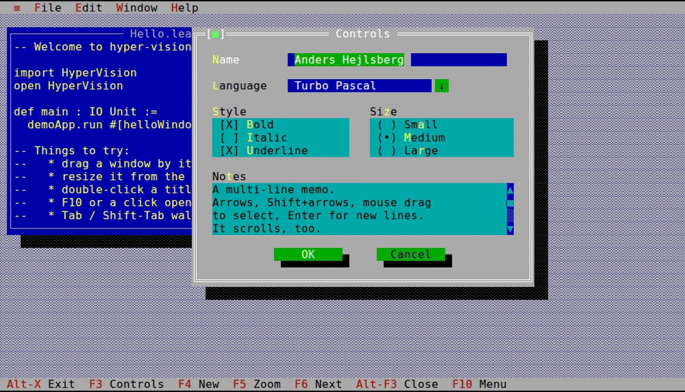

# hyper-vision

Turbo Vision for Lean 4.



```sh
lake build && .lake/build/bin/hyper-vision-demo   # proofs are checked by the build
lake test                                         # property tests and fuzzing
```
