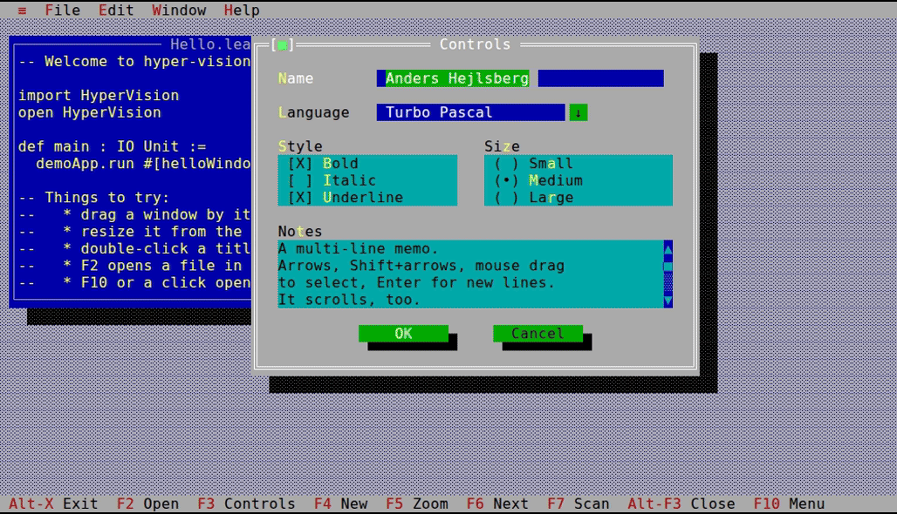

# hyper-vision

Turbo Vision for Lean 4.



```sh
lake build && .lake/build/bin/hyper-vision-demo   # proofs are checked by the build
lake test                                         # property tests and fuzzing
```

A command handler (`App.onCommand`) can start background `Job`s: `IO` actions that
run off the event loop so slow work does not freeze the UI. When a job finishes its
result is delivered back on the main loop and dispatched as an ordinary application
command. Press `F7` in the demo to start a fake async scan and watch the spinner
animate while the windows stay live.

Controls can issue commands of their own: `Control.onChange` when their value changes
(text typed into an input line, a choice from a combo box, the focus moving in a list
box) and `Control.onActivate` when they are activated (a list entry chosen, a link
followed). Keys that nothing handled — not the status line, the menus, the focused
control or its window — go to `App.keyCommand`, so an application can, say, move a
list's selection while the focus stays in a search field.

`TextView` shows formatted, read-only text: paragraphs of styled spans, word-wrapped
with indentation and hanging indents, scrollable, with links that are followed with
`Enter` or a click. A combo box created with `editable := false` is a drop-down list.
